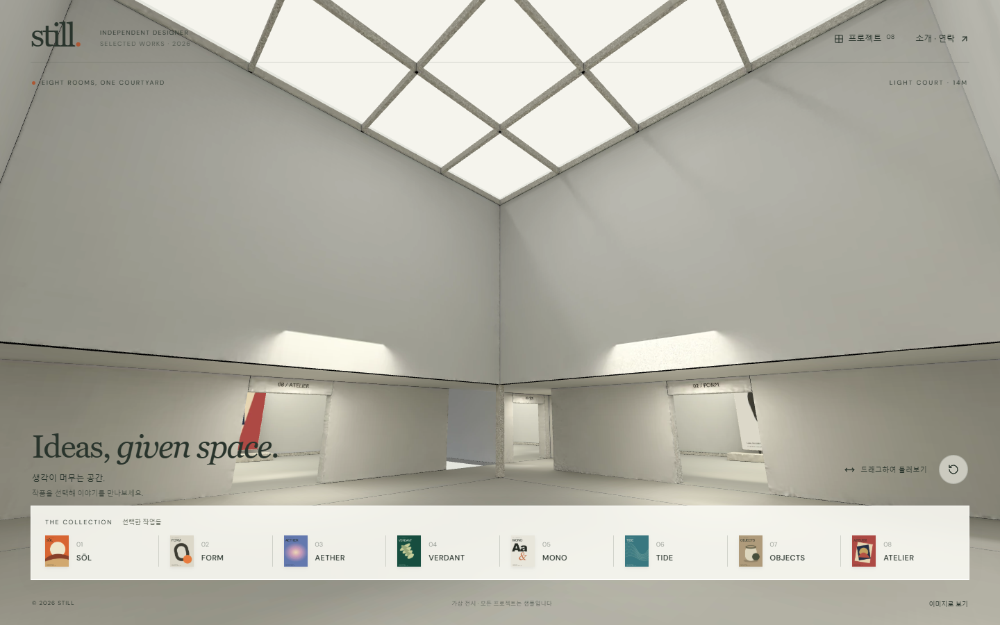
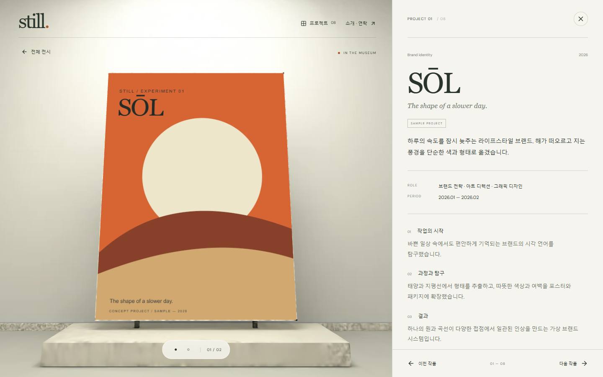

# STILL — 중정을 둘러싼 여덟 전시실

첨부된 D 평면을 기준으로 54×54m의 박물관을 제작했습니다. 중앙의 16×16m 채광 중정과 폭 4m의 순환 회랑이 여덟 전시실을 연결합니다. 각 방의 천장은 12m이고 중정은 14m입니다. **입구 바로 앞 가벽은 여덟 방 모두 제거했습니다.** 작품을 선택하면 같은 3D 건물 안에서 접근하고, 데스크톱은 왼쪽 작품·오른쪽 설명, 모바일은 위쪽 작품·아래쪽 설명으로 전환됩니다.

현재 이름, 소개, 프로젝트, 영상은 모두 샘플입니다. 실제 자료로 교체한 후 공개하세요.

## 웹사이트 미리보기

실제 실행 중인 사이트를 1440×900 화면에서 캡처했습니다. (2026-10-06 · 샘플 콘텐츠)

**전시장 첫 화면** — 높은 채광 중정과 여덟 전시실로 이동하는 작품 목록입니다.

**작품 상세 화면** — 3D 공간 안에서 작품을 가까이 보고, 오른쪽에서 프로젝트 설명을 읽습니다.

## 실행과 관람

처음 한 번 `npm install`을 실행한 뒤 `npm run dev`로 시작합니다. 개발 주소는 `http://127.0.0.1:5173/`입니다. `npm run build`는 배포용 파일을 `dist`에 만들고 `npm run preview`로 `http://127.0.0.1:4173/`에서 확인합니다.

- 첫 화면은 채광 중정입니다. 상단의 프로젝트 버튼을 누르면 중앙 중정과 여덟 방의 배치도가 나타납니다.
- 배치도, 하단 목록, 실제로 보이는 캔버스를 선택하면 해당 작품으로 이동합니다. 고정 벽 뒤에 가려진 작품은 클릭되지 않습니다.
- 이동은 열린 중정을 활용하는 짧은 경로를 따릅니다. 관람 높이를 유지하고 모퉁이에서 부드럽게 방향을 바꾸며, 전체 보기로 돌아갈 때는 불필요한 회전을 줄입니다.
- 상세 화면에서 이미지·영상을 넘겨봅니다. AETHER의 세 번째 자료는 사용자가 재생하는 샘플 영상입니다.
- 이전·다음, 좌우 방향키로 작품을 바꾸고 닫기·전체 전시·Esc로 선택 전 시점에 돌아갑니다. `#/project/sol`처럼 작품 주소를 공유할 수 있습니다.
- 움직임 감소 설정에서는 즉시 전환합니다. 3D를 사용할 수 없는 환경에서는 이미지와 설명으로 관람합니다.

## 파일 안내

| 결과물 | 위치 |
|---|---|
| 사용자가 지정한 원본 D 도면 | `assets/design/revision-d/` |
| 가벽을 제거한 수정 평면·단면·치수 | `assets/design/revision-d-open/` |
| 부품별로 편집하는 Blender 원본 | `assets/source/revision-d-open/gallery-editable.blend` |
| 조명과 UV를 편집하는 계산 전 원본 | `assets/source/revision-d-open/gallery-materials.blend` |
| 계산한 조명 이미지를 포함한 Blender 원본 | `assets/source/revision-d-open/gallery.blend` |
| 다른 3D 뷰어용 질감 포함 모델 | `assets/source/revision-d-open/gallery-textured.glb` |
| 웹 모델과 화면별 질감 | `public/models/gallery.glb`, `public/textures/` |
| UV 배치도·시험·최종·잡음 제거 이미지 | `assets/source/revision-d-open/*-uv.svg`, `*_test.png`, `*_final.png`, `*_clean.png` |
| 검증 기록 | `docs/verification.md` (검사 실행 시 생성되는 `artifacts/`는 Git에서 제외) |
| 콘텐츠 교체 안내 | `docs/content-guide.md` |

개정 C·E와 원본 D 자료는 제작 이력으로 남겨 두었습니다. 현재 실행되는 버전은 **D-open: 원본 D에서 입구 가벽을 제거한 안**입니다.

## 제작 재현

Blender 5.1.1의 독립 백그라운드 작업으로 제작했습니다. Blender 단계는 `blender --factory-startup -b -t 10 --python <스크립트> -- <단계>` 형식으로 실행합니다.

1. `node scripts/prepare-museum.mjs`로 원본 D의 방·작품·출입구 좌표와 치수를 읽고 가벽 없는 공간 자료를 만듭니다. `src/data/layout.json`은 생성 결과입니다.
2. `node scripts/d-open-drawing.mjs`, `node scripts/d-open-section.mjs`로 수정 평면도와 단면도를 만듭니다.
3. `scripts/build-museum.py -- prepare`를 Blender에서 실행하여 개별 부품 원본, UV 원본과 공간 시안을 만듭니다.
4. `scripts/build-museum.py -- bake`로 전시실 8개·회랑·중정을 각각 시험 계산한 뒤 2048px 조명 지도를 만듭니다. 이름을 뒤에 지정하면 해당 구역만 다시 계산합니다.
5. `python scripts/denoise-bakes.py --museum`으로 계산 잡음을 제거합니다. NumPy와 Pillow 및 Blender에 포함된 Open Image Denoise를 사용합니다. 원본 계산 이미지도 보관합니다.
6. `scripts/build-museum.py -- finish`로 최종 원본·웹 모델·대체 이미지를 저장합니다. `node scripts/museum-web-assets.mjs`로 데스크톱 2048px·모바일 1024px WebP를 만든 뒤 `npm run build`를 실행합니다.

웹 GLB에는 형상과 UV가 들어 있고 질감은 별도 파일로 연결됩니다. 다른 뷰어에는 `gallery-textured.glb`를 사용하세요. 프로젝트 이미지·영상은 건물 질감과 분리되어 있습니다.

## 검증

- `npm test`: D 도면 일치, 가벽 없는 입구, 모든 방 사이 이동, 연속 선택, 화면별 작품 구도.
- `node scripts/prepare-camera-audit.mjs` 후 Blender에서 `scripts/audit-museum.py`: 실제 모델 면의 카메라 충돌과 입구에서 작품을 향한 시선 검사.
- Blender에서 `scripts/verify-museum-source.py`: 원본 재열기, 이미지 포함 여부, 방 크기와 가벽 부재 검사.
- `node scripts/verify-browser.mjs`: 실제 관람·미디어·키보드·모바일·오류 대응.
- `node scripts/measure-performance.mjs`, `node scripts/measure-transfer.mjs`: 현재 PC의 이동 성능과 첫 전송량.

실제 측정 결과와 확인 범위는 `docs/verification.md`에 기록합니다. 공개 배포는 수행하지 않았습니다.
